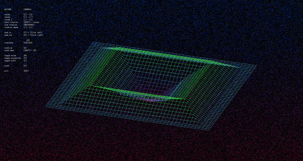

# Wireframe  - fdf

This repo contains a graphical interfave build in C using the [minilibX] (https://harm-smits.github.io/42docs/libs/minilibx) library build on [X Window System (X11)] (https://x.org/wiki/)
Pass a file with a format comparable to the ones in the maps folder to get it projected in a 3D-Wireframe.

## Installation
In the root directory call `make`.
You need the following libraries installed in order to properly compile it.

## Run
If "fdf" was created simply execute it with `./fdf <mapfile>` , where mapfile can have any format as long as it follows the given structure:
- n lines with the same amount of space seperated integers
- each element can have an extra color attribute encoded in ARGB Hex format and seperated from the aptitude with a comme

## Disclaimer
This project is part of my 42 School Curriculum
