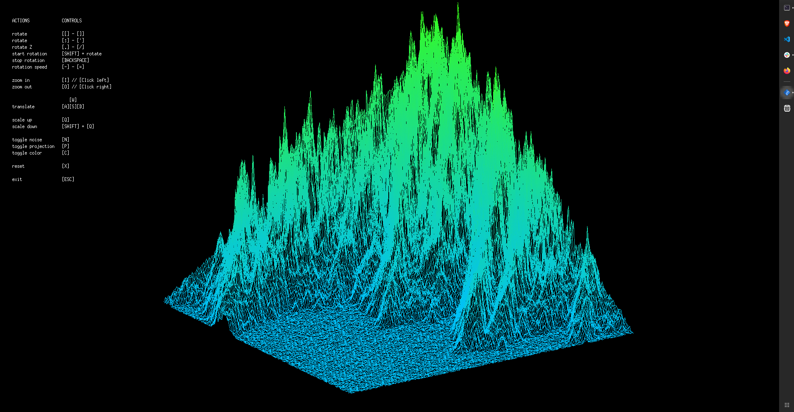
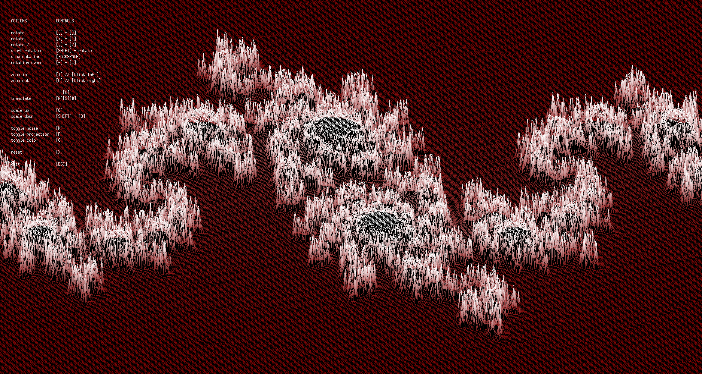

# **Wireframe - fdf**  


This repository contains a **graphical interface** built in **C** using the [MiniLibX](https://harm-smits.github.io/42docs/libs/minilibx) library, which is based on the [X Window System (X11)](https://x.org/wiki/).  
Pass a file formatted similarly to those in the **maps** folder to visualize it as a **3D wireframe projection**.  






## **Installation**  
To compile the program, run:  
```sh
make
```
You need the following libraries installed in order to properly compile it.
`sudo apt-get install libxext-dev libx11-dev`

## Run
If "fdf" was created simply execute it with `./fdf <mapfile>` , where mapfile can have any format as long as it follows the given structure:
- n lines with the same amount of space seperated integers
- each element can have an extra color attribute encoded in ARGB Hex format and seperated from the aptitude with a comme

## Disclaimer
This project is part of my 42 School Curriculum
